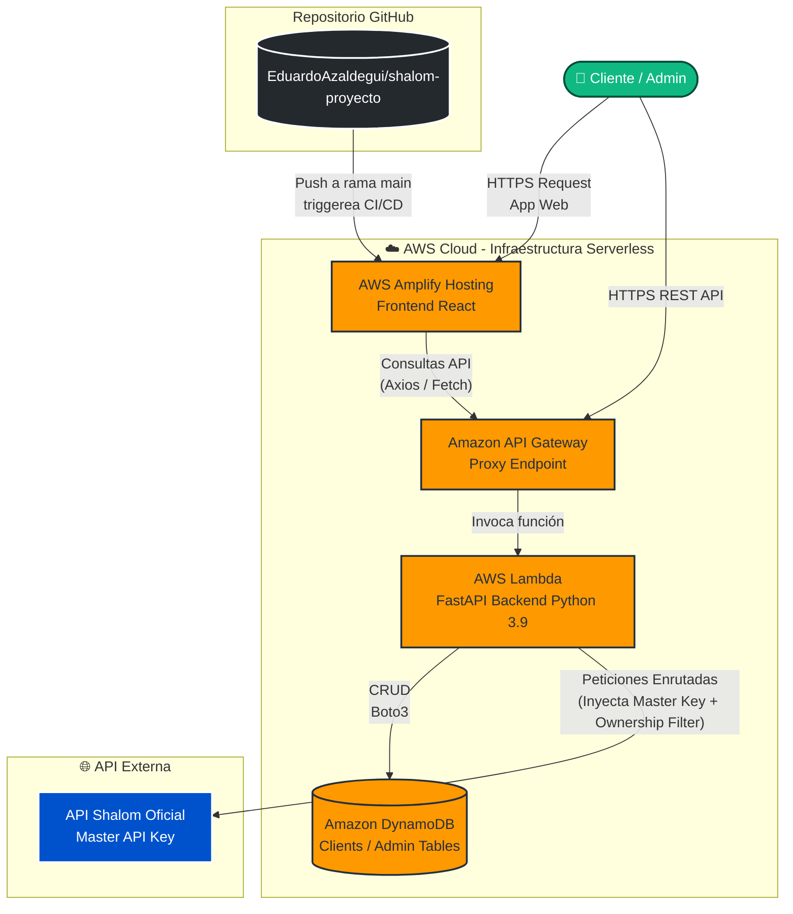

# Arquitectura e Infraestructura — Shalom Proxy

## Resumen de la Arquitectura (Zero-Touch & Serverless)

La plataforma "Shalom Proxy" funciona 100% *Serverless* sobre AWS. Se divide en dos capas con plataformas y workflows de deploy completamente independientes.



---

## 1. Frontend — AWS Amplify

- **Framework:** React 19 + Vite 8 + TailwindCSS 3 + React Router 7
- **Repositorio:** GitHub (`EduardoAzaldegui/shalom-proyecto`)
- **Deploy:** CI/CD automático — push a `main` → Amplify compila en 2-3 min
  - Build: `npm install --prefix frontend && npm run build --prefix frontend`
- **Configuración crítica:** `VITE_API_BASE` configurada en consola AWS Amplify (NO en código ni .env)
- **Páginas:**
  - `/admin` → `AdminLogin.jsx` + `AdminPanel.jsx` — gestión de clientes B2B
  - `/docs?token=<magic_token>` → `ClientDocs.jsx` — portal interactivo con playground

### Testing Frontend
```
# NO usar para testear producción (VITE_API_BASE no apuntará al Lambda real)
cd frontend && npm run dev

# Flujo correcto:
git push origin main            # Amplify auto-deploya
# Abrir [AMPLIFY_URL]/docs?token=<magic_token>    # Testear ClientDocs
# Abrir [AMPLIFY_URL]/admin                        # Testear AdminPanel
```

### Obtener magic_token de un cliente
```python
# desde la raíz del repo
import boto3
dynamodb = boto3.resource('dynamodb', region_name='us-east-1')
table = dynamodb.Table('shalom-proxy-api-clients-dev')
active = [i for i in table.scan()['Items'] if i.get('status') == 'active']
print(active[0]['magic_token'])  # usar en /docs?token=...
```

---

## 2. Backend — AWS Lambda + API Gateway

- **Framework:** FastAPI + Mangum (adaptador Lambda)
- **Runtime:** Python 3.9 | **IaaC:** Serverless Framework v3
- **URL producción:** `https://9lrgs4st13.execute-api.us-east-1.amazonaws.com/dev`
- **Base de datos:** DynamoDB
  - `shalom-proxy-api-clients-dev` — instancias de clientes B2B (incluye `person_name`, `person_document`)
  - `shalom-proxy-api-admin-dev` — credenciales de administrador

### Deploy Backend

> ⚠️ **Windows/PowerShell:** `npx` no funciona (execution policy). Usar node directamente.

```powershell
# Desde la raíz del repo:

# 1. Syntax check obligatorio antes de deployar
venv\Scripts\python.exe -m py_compile backend\main.py

# 2. Deploy a AWS Lambda
node "C:\Program Files\nodejs\node_modules\serverless\bin\serverless.js" deploy --stage dev
```

### Testing Backend
```python
# Siempre usar el venv del repo, nunca python global
venv\Scripts\python.exe script_de_test.py

# Ejemplo: test de endpoint real
import requests
API = 'https://9lrgs4st13.execute-api.us-east-1.amazonaws.com/dev'
r = requests.post(f'{API}/proxy',
    json={'method': 'post', 'path': '/track', 'body': {'orderNumber': '79401580', 'orderCode': 'WHPM'}},
    headers={'x-api-key': '<api_key_del_cliente>'})
print(r.status_code, r.json())
```

---

## 3. Ownership Filter (Seguridad de Tenancy)

El proxy valida que cada cliente solo acceda a **sus propias guías** comparando el DNI del remitente de la guía contra el DNI del usuario autenticado en Shalom.

### Endpoints protegidos
`/track`, `/track-massive`, `/ticket-image`, `/ticket-pdf`, `/label`

### Respuestas
| Escenario | HTTP |
|-----------|------|
| Guía propia, existe | `200 OK` |
| Guía existe, pertenece a otra cuenta | `403 Forbidden` — "Acceso denegado" |
| Guía no encontrada en Shalom | `404 Not Found` — mensaje exacto de Shalom |
| `/track-massive` con guías ajenas/inexistentes | `200 OK` con lista vacía `[]` |

### Caché
`get_shalom_user_document()` cachea el DNI del usuario en memoria por 5 minutos por `instance_id` — evita llamar a `/get-user` en cada request de tracking.

---

## 4. Admin Endpoints

| Método | Path | Descripción |
|--------|------|-------------|
| `POST` | `/admin/login` | Login admin |
| `GET` | `/admin/clients` | Listar clientes |
| `POST` | `/admin/clients` | Crear cliente (guarda `person_name`, `person_document` via `/get-user`) |
| `PUT` | `/admin/clients/:id/status` | Activar/desactivar cliente |
| `DELETE` | `/admin/clients/:id` | Eliminar cliente |
| `POST` | `/admin/clients/:id/regenerate-token` | Nuevo magic link |
| `GET` | `/admin/clients/:id/user` | Ver datos live del remitente en Shalom (cached + live) |

---

## 5. Guía de Prueba Real (LOGIPACK)

| Campo | Valor |
|-------|-------|
| N° Orden | `79401580` |
| Código | `WHPM` |
| Remitente | JERRY RODRIGO CCOLLANA SALAZAR |
| DNI Remitente | `47676522` |
| Destino | PIURA / AV. GRAU - AEREO |
| Estado | En tránsito |

---

## 6. Estimación de Costos

El stack opera **100% en Free Tier** para volumen bajo-medio:

| Servicio | Free Tier Mensual | Costo extra |
|----------|------------------|-------------|
| AWS Lambda | 1M requests / 400K GB-s | ~$0.20/M requests |
| API Gateway | 1M calls | ~$3.50/M calls |
| DynamoDB | 25 GB / 25 WCU-RCU | ~$1.25/M writes |
| Amplify Hosting | 1000 min build / 15 GB BW | $0.01/min build |

Para <1M requests/mes: **$0.00** (Free Tier permanente).

---

## 7. Flujo de Trabajo Completo

```
┌─ Cambio en BACKEND ──────────────────────────────────────────┐
│  1. Editar backend/main.py o backend/database.py             │
│  2. venv\Scripts\python.exe -m py_compile backend\main.py    │
│  3. node [serverless.js] deploy --stage dev  (esperar ~65s)  │
│  4. Testear con script Python contra URL de API Gateway       │
└──────────────────────────────────────────────────────────────┘

┌─ Cambio en FRONTEND ─────────────────────────────────────────┐
│  1. Editar frontend/src/pages/*.jsx                           │
│  2. git add . && git commit -m "feat: ..."                   │
│  3. git push origin main                                     │
│  4. Amplify auto-build (2-3 min)                             │
│  5. Verificar en browser [AMPLIFY_URL]/docs?token=...        │
└──────────────────────────────────────────────────────────────┘
```
