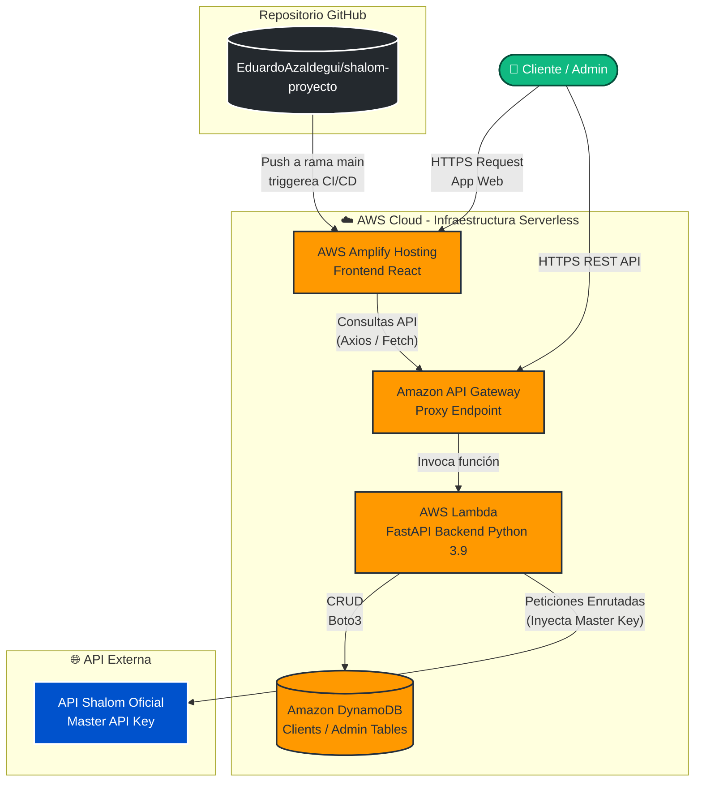

# Arquitectura e Infraestructura de Shalom Proxy

## Resumen de la Arquitectura (Zero-Touch & Serverless)

La plataforma "Shalom Proxy" ha sido rediseñada para funcionar de manera 100% *Serverless*, garantizando alta disponibilidad sin costos base de mantenimiento (pago por uso). La arquitectura se divide en dos capas principales:




### 1. Frontend (Capa de Presentación)
- **Servicio:** AWS Amplify Hosting
- **Repositorio:** GitHub (`EduardoAzaldegui/shalom-proyecto`)
- **Despliegue:** Monorepo CI/CD configurado para la subcarpeta `/frontend`. Cada vez que se hace push a `main`, Amplify compila usando `npm install --prefix frontend` y `npm run build --prefix frontend`.
- **Variables de Entorno:** Utiliza `VITE_API_BASE` para inyectar dinámicamente la URL del API Gateway sin quemar código.

### 2. Backend (Capa Lógica y Proxy)
- **Servicio Principal:** AWS Lambda (Python 3.9)
- **Gateway:** Amazon API Gateway (Proxy Endpoint)
- **Base de Datos:** Amazon DynamoDB (Tablas: `shalom-proxy-api-clients-dev`, `shalom-proxy-api-admin-dev`)
- **Adaptador:** `Mangum` para empaquetar la aplicación FastAPI dentro del entorno Lambda.
- **Orquestación IaaC:** Serverless Framework v3

---

## Estimación de Costos (Capa Gratuita / Volumen Bajo-Medio)

El ecosistema entero está bajo el esquema **Pay-as-you-go**. Si no hay tráfico, el costo es literalmente **$0.00 al mes**.

| Servicio | Capa Gratuita Mensual (AWS Free Tier) | Costo tras exceder Capa Gratuita |
| :--- | :--- | :--- |
| **AWS Lambda** | 1 Millón de peticiones / 400,000 GB-segundos | ~$0.20 por 1 millón de requests adicionales |
| **Amazon API Gateway** | 1 Millón de llamadas REST API | ~$3.50 por millón de llamadas adicionales |
| **Amazon DynamoDB** | 25 GB almacenamiento, 25 WCU/RCU (suficiente para millones de lecturas) | ~$1.25 por millón de escrituras adicionales |
| **AWS Amplify (Hosting)** | 1000 minutos de Build, 15 GB ancho de banda servido | $0.01 por min de Build, $0.15 por GB servido adicional |

### Conclusión de Costos
Para un proxy B2B de volumen bajo-medio (menos de 1,000,000 llamadas al mes y picos predecibles), la infraestructura operará al **100% dentro de la Capa Gratuita Permanente (Free Tier)** de AWS. Aún asumiendo un volumen de 5 millones de transacciones mensuales (bastante alto), la factura difícilmente excedería los **$20 - $30 USD** mensuales combinados, sin necesidad de gastar horas manteniendo VPS o contenedores.

---

## Mantenimiento y Extensión

### Frontend (Amplify)
- Cualquier cambio realizado y *pusheado* a la rama `main` en GitHub activará la *pipeline* automática de AWS Amplify. En 2-3 minutos los cambios estarán reflejados en producción.
- Para modificar la ruta del backend, agrega o modifica la variable de entorno `VITE_API_BASE` desde la Consola de AWS Amplify.

### Backend (Serverless)
- Para modificar la lógica del Proxy, edita `backend/main.py` de forma local.
- Para desplegar los cambios al entorno AWS, debes tener las llaves programáticas (AWS Access Key ID) exportadas en tu terminal y ejecutar el siguiente comando desde la carpeta `/backend`:
  ```bash
  npx serverless deploy
  ```

### Base de Datos (DynamoDB)
- La base de datos es ahora administrada y **stateless**. Se han reemplazado las tablas SQL por tablas NoSQL en DynamoDB usando `boto3`. No requiere respaldos de servidor ni configuración de motores de BD.
- Se configuraron GSI (Global Secondary Indexes) para búsquedas rápidas por `magic_token` y `api_key`.
